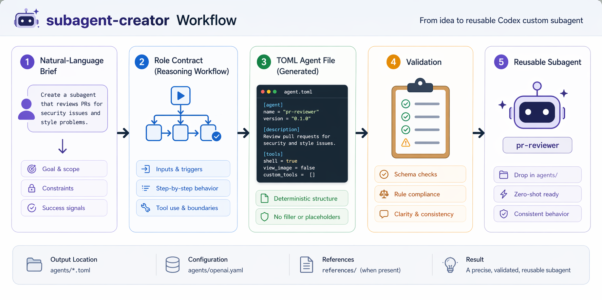

# codex-skills

[English README](README.md)

재사용 가능한 Codex 스킬을 모아 두는 저장소다. 각 스킬은 별도 폴더에 들어가며, 기본적으로 `SKILL.md`와 필요할 때 참조 문서, 스크립트, 에셋을 함께 포함한다.


이 저장소는 작고 설치 가능한 스킬 카탈로그로 쓰면 된다. `$skill-installer`로 원하는 스킬을 Codex 스킬 디렉터리에 설치하고, Codex를 다시 시작한 뒤 작업에 맞는 스킬 이름을 호출한다.

## 저장소 구조

- `skills/`: Codex 스킬 디렉터리로 복사해 사용할 수 있는 스킬 폴더들
- `skills/*/SKILL.md`: 스킬이 트리거될 때 Codex가 읽는 지침 본문
- `skills/*/scripts/`: 스킬과 함께 배포되는 보조 스크립트
- `skills/*/references/`: 스킬이 필요할 때 읽는 참조 문서
- `skills/*/agents/`: 스킬별 agent/provider 메타데이터
- `docs/assets/`: README 이미지와 저장소 수준 문서 에셋

## 설치 방법

이 저장소의 스킬은 기본 내장된 시스템 스킬 `$skill-installer`로 설치하면 된다. 각 스킬 항목 아래에는 그대로 복사해서 붙여 넣을 수 있는 한 줄 프롬프트를 적어 두었다.

스킬을 설치한 뒤에는 Codex를 다시 시작해야 반영된다.

## 스킬 선택

| 필요한 작업 | 사용할 스킬 | 결과 |
| --- | --- | --- |
| 프로젝트 안에 생성형 raster 이미지 저장 | `image-creator` | 저장된 이미지 파일과 실제 전달된 최종 프롬프트 |
| 새 프론트엔드 UI 제작 또는 큰 리디자인 | `ui-blueprint` | 생성된 UI mockup, 시각 추출 노트, 구현된 UI |
| Codex 커스텀 서브에이전트 생성 또는 갱신 | `subagent-creator` | 검증 가능한 단일 TOML agent 정의 |
| Codex와 오목 대국 | `gomoku` | Python GUI 보드와 Codex 착수를 위한 JSON 상태 브리지 |

## 현재 포함된 스킬

### `image-creator`


| 항목 | 내용 |
| --- | --- |
| 위치 | `skills/image-creator` |
| 사용 시점 | 생성형 또는 편집된 raster 이미지를 현재 프로젝트에 저장해야 할 때 |
| 하는 일 | 사용자 요청을 간결한 이미지 프롬프트로 재구성하고, 이미지 안에 들어갈 정확한 문구와 명시 제약을 보존하며, 생성 경로 호출 뒤 결과를 저장한다. |
| 하지 않는 일 | 로컬 입력 이미지 브리지 단계 밖에서 `view_image`를 쓰지 않고, 새 창작 제약을 임의로 만들지 않으며, SVG/HTML/CSS 같은 코드 기반 그래픽을 처리하지 않는다. |

설치:

```text
Use $skill-installer to install https://github.com/smturtle2/codex-skills/tree/main/skills/image-creator
```

### `ui-blueprint`

| 항목 | 내용 |
| --- | --- |
| 위치 | `skills/ui-blueprint` |
| 사용 시점 | 새 UI, 큰 리디자인, 시각 품질이 중요한 화면을 구현할 때 |
| 하는 일 | `image-creator`로 먼저 UI mockup을 만들고, 레이아웃과 시각 결정을 추출한 뒤 기존 프론트엔드 스택에 맞춰 구현한다. |
| 하지 않는 일 | 시각적으로 중요한 UI 작업에서 blueprint 생성을 건너뛰지 않고, 좁은 버그픽스나 작은 유지보수 수정에는 이 흐름을 적용하지 않는다. |

설치:

```text
Use $skill-installer to install https://github.com/smturtle2/codex-skills/tree/main/skills/ui-blueprint
```

### `subagent-creator`



| 항목 | 내용 |
| --- | --- |
| 위치 | `skills/subagent-creator` |
| 사용 시점 | 자연어 브리프에서 하나의 집중된 Codex 커스텀 서브에이전트를 만들어야 할 때 |
| 하는 일 | 역할 계약을 정리하고, TOML agent 정의를 작성하며, 기본값을 보수적으로 유지하고 가능한 경우 결과를 검증한다. |
| 하지 않는 일 | 기본적으로 여러 agent를 만들지 않고, MCP URL이나 credentials를 임의로 만들지 않으며, 브리프가 요구하지 않는 canned role example에 맞추지 않는다. |

설치:

```text
Use $skill-installer to install https://github.com/smturtle2/codex-skills/tree/main/skills/subagent-creator
```

이 스킬은 공식 Codex 서브에이전트 문서를 기준으로 작성됐다.

- https://developers.openai.com/codex/subagents
- https://developers.openai.com/codex/concepts/subagents

### `gomoku`

| 항목 | 내용 |
| --- | --- |
| 위치 | `skills/gomoku` |
| 사용 시점 | 로컬 Python GUI에서 사용자가 오목을 두고 Codex가 직접 다음 수를 골라 적용하게 할 때 |
| 하는 일 | Pygame 보드를 실행하고, 게임 상태를 내부적으로 관리하며, 착수와 승패 및 선택적 렌주 금수를 검증하고, Codex가 기다린 뒤 설정된 색으로 착수하게 한다. |
| 하지 않는 일 | 고정 AI 엔진을 구현하지 않고, GUI에서 OpenAI API를 호출하지 않는다. |

설치:

```text
Use $skill-installer to install https://github.com/smturtle2/codex-skills/tree/main/skills/gomoku
```

## 메모

- 이 저장소는 작게 시작해서 필요한 스킬을 추가하는 방식으로 유지한다.
- 루트 문서는 스킬 카탈로그 역할만 한다.
- 스킬별 상세 지침은 별도 README 대신 각 스킬 폴더 내부에 둔다.
