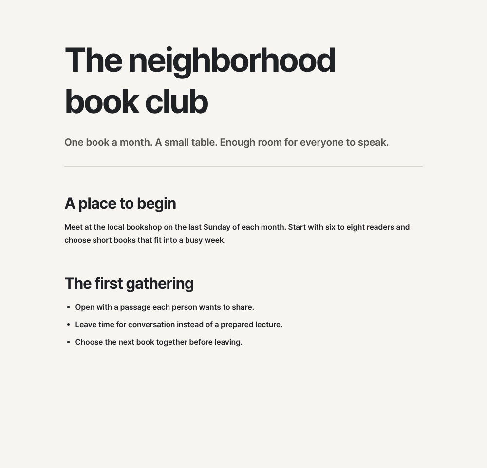

# codex-skills

[English](README.md) · **한국어**

생각을 정리하고, 무언가를 만들고, 가끔은 한 판 노는 Codex 작업대.


필요한 스킬만 골라 설치하세요. 각 폴더에는 지침과 필요한 보조 파일이 함께 들어 있습니다.

[정리하고 쓰기](#write) · [만들고 구현하기](#make) · [놀고 탐험하기](#play)

## 시작하기

Codex에 아래처럼 요청하세요. `<skill-name>`은 아래 목록의 이름으로 바꾸면 됩니다.

```text
Use $skill-installer to install skills/<skill-name> from https://github.com/smturtle2/codex-skills.
```

설치한 스킬은 `$스킬이름`으로 호출합니다. 새 스킬이 보이지 않으면 Codex를 다시 시작하세요. [공식 스킬 안내](https://learn.chatgpt.com/docs/build-skills)

아래 프롬프트는 사용 예시입니다. 결과물과 필요한 도구를 확인하고 선택하세요.

<a id="write"></a>

## 정리하고 쓰기

###  idea-scribe

**생각은 자유롭게, 정리는 조용하게.**

떠오르는 생각을 원문 그대로 기록하고, 현재 유효한 내용만 읽기 좋은 문서로 정리합니다.

```text
$idea-scribe로 동네 독서 모임 아이디어를 정리해줘. 내가 계속 말할 테니 끼어들지 말고 기록해.
```

**결과물** — `raw.txt`에는 원문이 쌓이고, `organized.html`에는 현재 정리본이 남습니다.



*포함된 HTML 템플릿에 독서 모임 예시 내용을 넣어 렌더링한 화면입니다.*

[스킬 지침](skills/idea-scribe/SKILL.md)

<details>
<summary>설치 프롬프트</summary>

```text
Use $skill-installer to install skills/idea-scribe from https://github.com/smturtle2/codex-skills.
```

</details>

###  epub-translator

**다른 언어로도 자연스럽게 읽히는 책.**

EPUB을 번역해 용어와 장 사이의 맥락이 이어지는 새 판본을 만듭니다.

```text
$epub-translator로 book.epub을 한국어로 번역해줘. 인명과 용어를 책 전체에서 일관되게 유지해.
```

**결과물** — 번역된 `.epub`, 번역 작업 파일, 검증 요약. 읽기 순서·링크·이미지 위치를 기준으로 책을 다시 구성합니다.

래스터 이미지 속 글자도 번역하려면 `image-creator`를 함께 설치하세요.

[스킬 지침](skills/epub-translator/SKILL.md)

<details>
<summary>설치 프롬프트</summary>

```text
Use $skill-installer to install skills/epub-translator from https://github.com/smturtle2/codex-skills.
```

</details>

###  podcast-writer

**자료를 듣기 좋은 이야기로.**

문서·웹사이트·YouTube 자료를 하나의 독백형 대본으로 엮고, 독립적인 내용 검토를 거쳐 다듬습니다.

```text
$podcast-writer로 이 자료를 초보자용 10분짜리 1인 팟캐스트 대본으로 만들어줘. 일반 텍스트로 저장해.
```

**결과물** — 말할 내용만 담긴 `.txt` 대본. 이후 TTS나 직접 녹음에 사용할 수 있습니다.

내용 검토에 서브에이전트 도구가 필요합니다. YouTube는 자막을 먼저 사용하며, 음성 전사로 대체할 때는 호환 GPU가 필요합니다.

[스킬 지침](skills/podcast-writer/SKILL.md)

<details>
<summary>설치 프롬프트</summary>

```text
Use $skill-installer to install skills/podcast-writer from https://github.com/smturtle2/codex-skills.
```

</details>

<a id="make"></a>

## 만들고 구현하기

###  image-creator

**설명에서 프로젝트 에셋까지.**

래스터 이미지를 생성·편집해 프로젝트에 저장합니다. 요청하면 처음부터 투명 배경 PNG로 생성합니다.

```text
$image-creator로 청록색 목도리를 두른 작은 주황 여우 마스코트를 투명 배경으로 만들어 assets/fox.png에 저장해줘.
```

**결과물** — 저장된 이미지, 실제 생성 프롬프트, 확인된 파일 형식·크기·요청한 투명도.

내장 이미지 생성 도구가 필요합니다. 위 배너도 이 작업 방식으로 만들었습니다.

[스킬 지침](skills/image-creator/SKILL.md)

<details>
<summary>설치 프롬프트</summary>

```text
Use $skill-installer to install skills/image-creator from https://github.com/smturtle2/codex-skills.
```

</details>

###  animation-creator

**하나의 캐릭터에 다양한 움직임을.**

동작을 의미 있는 자세 변화로 나누고, 같은 캐릭터 기준 이미지를 사용해 프레임을 생성합니다.

```text
$animation-creator로 이 여우가 손을 흔든 뒤 기본 자세로 돌아오는 루프 WebP를 만들어줘.
```

**결과물** — 애니메이션 WebP와 기준 이미지, 프레임 시트, 개별 프레임, 콘택트 시트, 검증 기록.

`image-creator`도 설치하세요. 로컬 보조 스크립트는 `uv`와 rembg로 프레임을 처리합니다.

[스킬 지침](skills/animation-creator/SKILL.md)

<details>
<summary>설치 프롬프트</summary>

```text
Use $skill-installer to install skills/image-creator and skills/animation-creator from https://github.com/smturtle2/codex-skills.
```

</details>

###  ui-blueprint

**만들 화면을 먼저 보고 시작하기.**

시각적 시안을 생성하고 디자인 결정을 정리한 뒤, 기존 프런트엔드 스택으로 화면을 구현합니다.

```text
$ui-blueprint로 이 앱의 독서 대시보드를 개편해줘. 읽는 책, 독서 진행률, 최근 메모가 보여야 해.
```

**결과물** — `ui-blueprints/`에 저장된 시안, 구현된 화면, 데스크톱·모바일 시각 검증.

`image-creator`도 설치하세요. 새 화면 제작과 큰 폭의 개편에 적합합니다.

[스킬 지침](skills/ui-blueprint/SKILL.md)

<details>
<summary>설치 프롬프트</summary>

```text
Use $skill-installer to install skills/image-creator and skills/ui-blueprint from https://github.com/smturtle2/codex-skills.
```

</details>

###  subagent-creator

**역할과 책임이 분명한 서브에이전트.**

역할 설명을 책임 범위와 제약이 명확한 Codex 커스텀 에이전트 정의로 바꿉니다.

```text
$subagent-creator로 접근성을 점검하고 파일 위치와 함께 문제를 보고하는 읽기 전용 리뷰어 하나를 만들어줘.
```

**결과물** — 검증된 TOML 정의. 기본 저장 위치는 개인 agents 디렉터리이며, 요청하면 프로젝트 범위로 저장하거나 미리보기만 제공합니다.

에이전트 정의를 만드는 스킬입니다. 실제 실행은 별도 단계입니다.

[스킬 지침](skills/subagent-creator/SKILL.md)

<details>
<summary>설치 프롬프트</summary>

```text
Use $skill-installer to install skills/subagent-creator from https://github.com/smturtle2/codex-skills.
```

</details>

<a id="play"></a>

## 놀고 탐험하기

###  world-simulator

**세계를 만들고, 선택의 다음 장면으로.**

브라우저 Studio에서 세계를 함께 만들고, 자연어 행동으로 이어지는 지속형 1인 RPG를 플레이합니다.

```text
$world-simulator로 기억을 거래하는 도시를 만들어줘. 첫 출근을 앞둔 견습 기록관으로 플레이하고 싶어.
```

**결과물** — 브라우저 Studio·Play 화면, 캐릭터 시트, 세계 설정집, 시간순 이야기, 재개 가능한 `world.sqlite3` 기록.

로컬 브라우저와 Python 실행 환경이 필요합니다. Codex가 이야기를 진행하고 런타임이 세계와 이력을 저장합니다.

[스킬 지침](skills/world-simulator/SKILL.md)

<details>
<summary>설치 프롬프트</summary>

```text
Use $skill-installer to install skills/world-simulator from https://github.com/smturtle2/codex-skills.
```

</details>

###  gomoku

**잠깐 쉬면서, 한 수.**

로컬 보드에서 돌을 두면 Codex가 판세를 읽고 다음 수를 선택합니다.

```text
$gomoku로 오목을 시작해줘. 15×15 보드에서 내가 흑으로 둘게.
```

**결과물** — 착수 검증, 승리 판정, 선택 가능한 렌주 제한을 갖춘 Pygame 보드.

데스크톱 GUI 환경과 Pygame을 실행할 Python이 필요합니다. 상대의 수는 Codex가 결정합니다.

[스킬 지침](skills/gomoku/SKILL.md)

<details>
<summary>설치 프롬프트</summary>

```text
Use $skill-installer to install skills/gomoku from https://github.com/smturtle2/codex-skills.
```

</details>

## 저장소 둘러보기

- [`skills/`](skills/) — 스킬별 지침, 스크립트, 참고 문서, 실행용 에셋과 아이콘.
- [`docs/assets/`](docs/assets/) — README 배너와 예시 화면.

## 기여하기

새 스킬에는 사용 시점이 명확한 `SKILL.md`와 필요한 파일을 함께 넣어 주세요. 지침은 간결하게 유지하고, 보조 스크립트는 로컬에서 검토할 수 있게 작성하세요. 아이콘·에이전트 메타데이터·두 언어의 README도 함께 갱신해 주세요.
