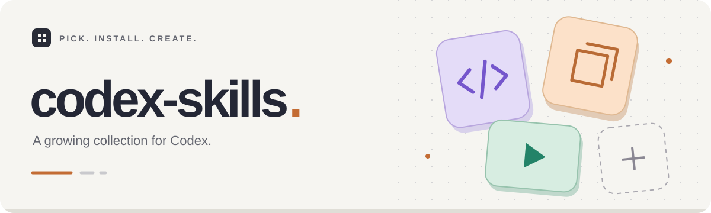

<p align="center">
  
</p>

<p align="center">필요한 작업에 맞춰 골라 쓰는 Codex 스킬 컬렉션.</p>
<p align="center"><a href="#skills">스킬 둘러보기</a> · <a href="CONTRIBUTING.ko.md">기여하기</a> · <a href="README.md">English</a></p>

<a id="install"></a>
<a id="skills"></a>

## 스킬

각 스킬 아래의 설치 명령을 복사해 Codex에 붙여 넣으세요. 설치 후 `$스킬이름`과 함께 작업을 요청하면 됩니다.

<!-- skills:start -->

<p align="center">
<a href="#animation-creator">animation&#8209;creator</a> · <a href="#epub-translator">epub&#8209;translator</a> · <a href="#gomoku">gomoku</a> · <a href="#idea-scribe">idea&#8209;scribe</a> · <a href="#image-creator">image&#8209;creator</a> · <a href="#podcast-writer">podcast&#8209;writer</a> · <a href="#subagent-creator">subagent&#8209;creator</a> · <a href="#ui-blueprint">ui&#8209;blueprint</a> · <a href="#user-dialog">user&#8209;dialog</a> · <a href="#world-simulator">world&#8209;simulator</a>
</p>

---

<a id="animation-creator"></a>


동작을 의미 있는 자세 변화로 나누고, 같은 캐릭터 기준 이미지를 사용해 프레임을 생성합니다.

```text
Use $skill-installer.
Repository:
https://github.com/smturtle2/codex-skills
Install from skills/:
image-creator, animation-creator
```

[사용 가이드](docs/skills/animation-creator.ko.md) · [지침](skills/animation-creator/SKILL.md)

---

<a id="epub-translator"></a>


EPUB을 번역해 용어와 장 사이의 맥락이 이어지는 새 판본을 만듭니다.

```text
Use $skill-installer.
Repository:
https://github.com/smturtle2/codex-skills
Install from skills/:
epub-translator
```

[사용 가이드](docs/skills/epub-translator.ko.md) · [지침](skills/epub-translator/SKILL.md)

---

<a id="gomoku"></a>


로컬 보드에서 돌을 두면 Codex가 판세를 읽고 다음 수를 선택합니다.

```text
Use $skill-installer.
Repository:
https://github.com/smturtle2/codex-skills
Install from skills/:
gomoku
```

[사용 가이드](docs/skills/gomoku.ko.md) · [지침](skills/gomoku/SKILL.md)

---

<a id="idea-scribe"></a>


떠오르는 생각을 원문 그대로 기록하고, 현재 유효한 내용만 읽기 좋은 문서로 정리합니다.

```text
Use $skill-installer.
Repository:
https://github.com/smturtle2/codex-skills
Install from skills/:
idea-scribe
```

[사용 가이드](docs/skills/idea-scribe.ko.md) · [지침](skills/idea-scribe/SKILL.md)

---

<a id="image-creator"></a>


래스터 이미지를 생성·편집해 프로젝트에 저장합니다. 요청하면 처음부터 투명 배경 PNG로 생성합니다.

```text
Use $skill-installer.
Repository:
https://github.com/smturtle2/codex-skills
Install from skills/:
image-creator
```

[사용 가이드](docs/skills/image-creator.ko.md) · [지침](skills/image-creator/SKILL.md)

---

<a id="podcast-writer"></a>


문서·웹사이트·YouTube 자료를 하나의 독백형 대본으로 엮고, 독립적인 내용 검토를 거쳐 다듬습니다.

```text
Use $skill-installer.
Repository:
https://github.com/smturtle2/codex-skills
Install from skills/:
podcast-writer
```

[사용 가이드](docs/skills/podcast-writer.ko.md) · [지침](skills/podcast-writer/SKILL.md)

---

<a id="subagent-creator"></a>


역할 설명을 책임 범위와 제약이 명확한 Codex 커스텀 에이전트 정의로 바꿉니다.

```text
Use $skill-installer.
Repository:
https://github.com/smturtle2/codex-skills
Install from skills/:
subagent-creator
```

[사용 가이드](docs/skills/subagent-creator.ko.md) · [지침](skills/subagent-creator/SKILL.md)

---

<a id="ui-blueprint"></a>


시각적 시안을 생성하고 디자인 결정을 정리한 뒤, 기존 프런트엔드 스택으로 화면을 구현합니다.

```text
Use $skill-installer.
Repository:
https://github.com/smturtle2/codex-skills
Install from skills/:
image-creator, ui-blueprint
```

[사용 가이드](docs/skills/ui-blueprint.ko.md) · [지침](skills/ui-blueprint/SKILL.md)

---

<a id="user-dialog"></a>


소통 목적에 맞는 팝업 인터페이스를 구성하고, 사용자의 반응을 받아 전달합니다.

```text
Use $skill-installer.
Repository:
https://github.com/smturtle2/codex-skills
Install from skills/:
user-dialog
```

[사용 가이드](docs/skills/user-dialog.ko.md) · [지침](skills/user-dialog/SKILL.md)

---

<a id="world-simulator"></a>


브라우저 Studio에서 세계를 함께 만들고, 자연어 행동으로 이어지는 지속형 1인 RPG를 플레이합니다.

```text
Use $skill-installer.
Repository:
https://github.com/smturtle2/codex-skills
Install from skills/:
world-simulator
```

[사용 가이드](docs/skills/world-simulator.ko.md) · [지침](skills/world-simulator/SKILL.md)

<!-- skills:end -->

## 스킬 추가·개선

[`skills/`](skills/)의 각 폴더에는 `SKILL.md`와 필요한 보조 파일이 들어 있습니다. 사람을 위한 사용 가이드는 [`docs/skills/`](docs/skills/)에 있습니다.

스킬 추가·수정·삭제와 목록 갱신 방법은 [기여 가이드](CONTRIBUTING.ko.md)를 참고하세요. 예시 이미지와 개별 아이콘은 선택 사항입니다.
