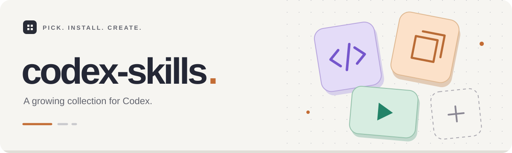

<p align="center">
  
</p>

<p align="center">필요한 작업에 맞춰 골라 쓰는 Codex 스킬 컬렉션.</p>
<p align="center"><a href="#skills">스킬 둘러보기</a> · <a href="CONTRIBUTING.ko.md">기여하기</a> · <a href="README.md">English</a></p>

<a id="install"></a>
<a id="skills"></a>

## 스킬

각 스킬 아래의 설치 명령을 복사해 Codex에 붙여 넣으세요. 설치 후 `$스킬이름`과 함께 작업을 요청하면 됩니다.

<!-- skills:start -->

<p align="center">
<a href="#animation-creator">animation&#8209;creator</a> · <a href="#epub-translator">epub&#8209;translator</a> · <a href="#gomoku">gomoku</a> · <a href="#image-creator">image&#8209;creator</a> · <a href="#jev-developer">jev&#8209;developer</a> · <a href="#ui-blueprint">ui&#8209;blueprint</a> · <a href="#user-dialog">user&#8209;dialog</a>
</p>

---

<a id="animation-creator"></a>


동작을 의미 있는 자세 변화로 나누고, 같은 캐릭터 기준 이미지를 사용해 프레임을 생성합니다.

```text
Use $skill-installer.
Repository:
https://github.com/smturtle2/codex-skills
Install from skills/:
image-creator, animation-creator
```

[사용 가이드](docs/skills/animation-creator.ko.md) · [지침](skills/animation-creator/SKILL.md)

---

<a id="epub-translator"></a>


EPUB을 번역해 용어와 장 사이의 맥락이 이어지는 새 판본을 만듭니다.

```text
Use $skill-installer.
Repository:
https://github.com/smturtle2/codex-skills
Install from skills/:
epub-translator
```

[사용 가이드](docs/skills/epub-translator.ko.md) · [지침](skills/epub-translator/SKILL.md)

---

<a id="gomoku"></a>


로컬 보드에서 돌을 두면 Codex가 판세를 읽고 다음 수를 선택합니다.

```text
Use $skill-installer.
Repository:
https://github.com/smturtle2/codex-skills
Install from skills/:
gomoku
```

[사용 가이드](docs/skills/gomoku.ko.md) · [지침](skills/gomoku/SKILL.md)

---

<a id="image-creator"></a>


래스터 이미지를 생성·편집해 프로젝트에 저장합니다. 요청하면 처음부터 투명 배경 PNG로 생성합니다.

```text
Use $skill-installer.
Repository:
https://github.com/smturtle2/codex-skills
Install from skills/:
image-creator
```

[사용 가이드](docs/skills/image-creator.ko.md) · [지침](skills/image-creator/SKILL.md)

---

<a id="jev-developer"></a>


증거 표현, 유형이 지정된 질문, 답변 의미, 판단 구성에 관한 구체적인 지식을 활용해 Jev 통합을 개발합니다.

```text
Use $skill-installer.
Repository:
https://github.com/smturtle2/codex-skills
Install from skills/:
jev-developer
```

[사용 가이드](docs/skills/jev-developer.ko.md) · [지침](skills/jev-developer/SKILL.md)

---

<a id="ui-blueprint"></a>


시각적 시안을 생성하고 디자인 결정을 정리한 뒤, 기존 프런트엔드 스택으로 화면을 구현합니다.

```text
Use $skill-installer.
Repository:
https://github.com/smturtle2/codex-skills
Install from skills/:
image-creator, ui-blueprint
```

[사용 가이드](docs/skills/ui-blueprint.ko.md) · [지침](skills/ui-blueprint/SKILL.md)

---

<a id="user-dialog"></a>


입력 필드와 Markdown 문서, 이미지 또는 문서 파일 경로를 자유롭게 조합해 팝업을 만들고 응답을 원래 Codex 작업에 사용자 메시지로 전달합니다.

```text
Use $skill-installer.
Repository:
https://github.com/smturtle2/codex-skills
Install from skills/:
user-dialog
```

[사용 가이드](docs/skills/user-dialog.ko.md) · [지침](skills/user-dialog/SKILL.md)

<!-- skills:end -->

## 스킬 추가·개선

[`skills/`](skills/)의 각 폴더에는 `SKILL.md`와 필요한 보조 파일이 들어 있습니다. 사람을 위한 사용 가이드는 [`docs/skills/`](docs/skills/)에 있습니다.

스킬 추가·수정·삭제와 목록 갱신 방법은 [기여 가이드](CONTRIBUTING.ko.md)를 참고하세요. 예시 이미지와 개별 아이콘은 선택 사항입니다.
