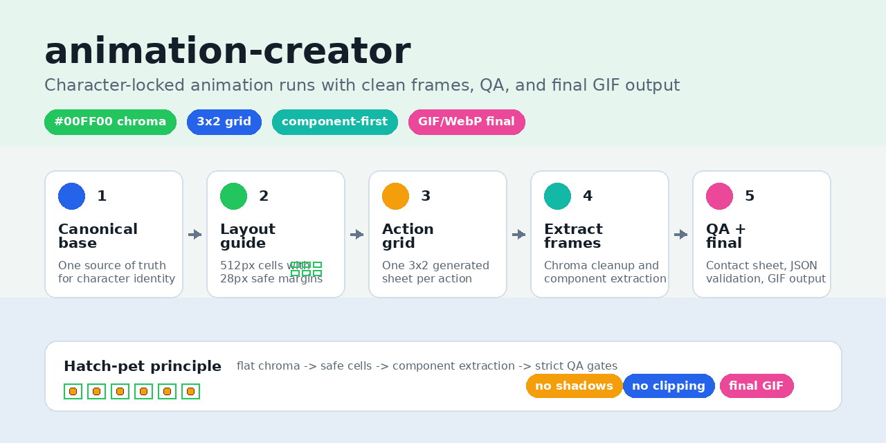
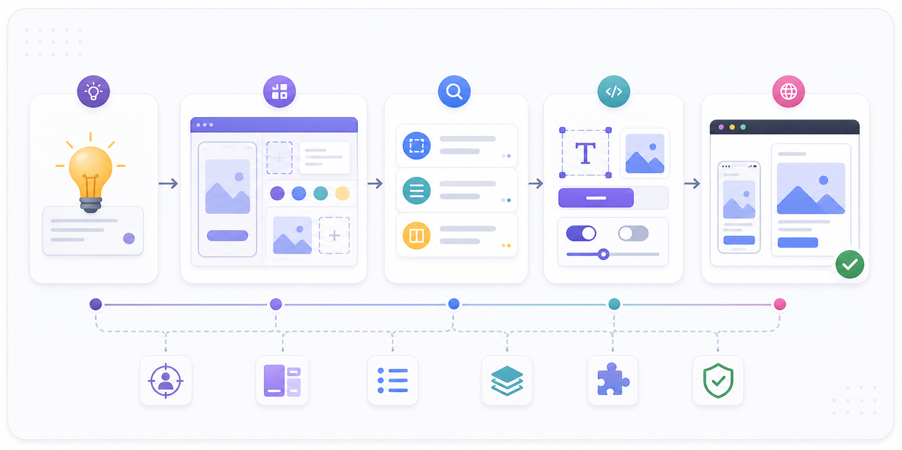
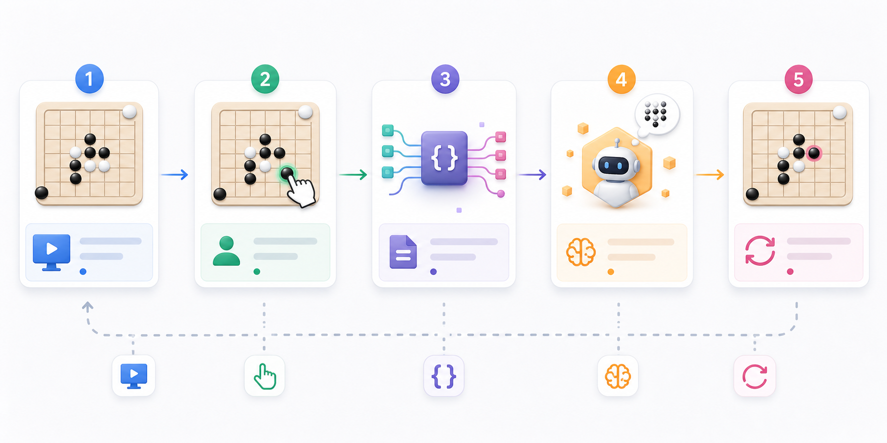

# codex-skills

[](#skills) [](#quick-install) [](docs/assets) [](README.ko.md)

A small, installable catalog of Codex skills for image generation, animation assets, UI blueprints, subagent creation, and Gomoku.

Each skill is self-contained with a `SKILL.md` trigger contract plus any local scripts, references, assets, and agent metadata it needs.

Languages: English | [한국어](README.ko.md)


## Why Use This

- Self-contained skills that can be copied into a Codex skills directory.
- Copy-paste install prompts for each skill.
- Practical workflows, not demos.
- Small enough to audit before installing.

## Skills

| Skill | Best for | Output | Install |
| --- | --- | --- | --- |
| [`image-creator`](#image-creator) | Generating or editing project-local raster images | Saved image file plus the exact rewritten prompt | [Prompt](#image-creator) |
| [`animation-creator`](#animation-creator) | Creating project-local character animation assets | Run folder with prompts, layout guides, frames, validation, contact sheets, and previews | [Prompt](#animation-creator) |
| [`ui-blueprint`](#ui-blueprint) | Building or substantially redesigning frontend UI | Generated UI mockup, visual notes, and implemented UI | [Prompt](#ui-blueprint) |
| [`subagent-creator`](#subagent-creator) | Creating one focused Codex custom subagent | Validated TOML agent definition | [Prompt](#subagent-creator) |
| [`gomoku`](#gomoku) | Playing Gomoku against Codex in a local GUI | Python board plus JSON state bridge for Codex moves | [Prompt](#gomoku) |

## Quick Install

Use the preinstalled `$skill-installer` system skill, then restart Codex so the installed skill is picked up.

```text
Use $skill-installer to install https://github.com/smturtle2/codex-skills/tree/main/skills/<skill-name>
```

## Catalog

### `image-creator`

Generate or edit raster images and save them into the current project.


| Field | Details |
| --- | --- |
| Folder | `skills/image-creator` |
| Use when | You need a generated or edited raster image saved into the current project. |
| Produces | A saved image file, the exact rewritten prompt, input-image notes when used, and the generation path used. |
| Avoids | `view_image` outside the immediate local-image bridge step, invented creative constraints, and code-native SVG/HTML/CSS artwork. |

Install:

```text
Use $skill-installer to install https://github.com/smturtle2/codex-skills/tree/main/skills/image-creator
```

### `animation-creator`

Create character animation assets from a source character image or a generated base character.



| Field | Details |
| --- | --- |
| Folder | `skills/animation-creator` |
| Use when | You need project-local sprite strips, frame sequences, GIF/WebP/MP4 previews, or additional actions that preserve one character identity. |
| Produces | A run folder with canonical base references, action prompts, layout guides, extracted frames, contact sheets, validation JSON, and previews. |
| Avoids | Global packaging, local code-generated character art, and accepting clipped or slot-crossing animation frames. |

Install:

```text
Use $skill-installer to install https://github.com/smturtle2/codex-skills/tree/main/skills/animation-creator
```

### `ui-blueprint`

Create a generated UI mockup first, then implement frontend work against that visual blueprint.



| Field | Details |
| --- | --- |
| Folder | `skills/ui-blueprint` |
| Use when | You are building new UI, doing a substantial redesign, or working on a visually led screen. |
| Produces | A generated mockup, extracted layout and visual decisions, and implementation guidance for the existing frontend stack. |
| Avoids | Skipping the blueprint for visually important UI work, and applying the workflow to narrow bug fixes or small maintenance edits. |

Install:

```text
Use $skill-installer to install https://github.com/smturtle2/codex-skills/tree/main/skills/ui-blueprint
```

### `subagent-creator`

Turn a natural-language role brief into one focused Codex custom subagent.


| Field | Details |
| --- | --- |
| Folder | `skills/subagent-creator` |
| Use when | You need one focused Codex custom subagent derived from a natural-language brief. |
| Produces | A TOML agent definition with a clear role, tool policy, constraints, and validation where possible. |
| Avoids | Creating multiple agents by default, inventing MCP URLs or credentials, and snapping to canned role examples unless required. |

Install:

```text
Use $skill-installer to install https://github.com/smturtle2/codex-skills/tree/main/skills/subagent-creator
```

Docs:

- https://developers.openai.com/codex/subagents
- https://developers.openai.com/codex/concepts/subagents

### `gomoku`

Play Gomoku with a local Python GUI while Codex waits, reads Codex view JSON, and applies its own moves.



| Field | Details |
| --- | --- |
| Folder | `skills/gomoku` |
| Use when | You want to play Gomoku with a local Python GUI while Codex chooses and applies its own moves. |
| Produces | A Pygame board, internally managed state, move validation, win detection, optional Renju restrictions, and Codex wait/apply commands. |
| Avoids | A fixed AI engine and OpenAI API calls from the GUI. |

Install:

```text
Use $skill-installer to install https://github.com/smturtle2/codex-skills/tree/main/skills/gomoku
```

## Repository Layout

- `skills/`: skill folders ready to copy into a Codex skills directory.
- `skills/*/SKILL.md`: the instruction body Codex reads when a skill is triggered.
- `skills/*/scripts/`: helper scripts bundled with a skill.
- `skills/*/references/`: optional supporting references used by a skill.
- `skills/*/agents/`: optional agent/provider metadata for a skill.
- `docs/assets/`: README images and repository-level documentation assets.

## Contributing

New skills should include a `SKILL.md`, a clear trigger description, and any required scripts or references inside the skill folder.

Quality bar:

- Clear trigger rules.
- Minimal bundled context.
- No hidden credentials.
- Local, auditable scripts.
- README entry and install prompt.

## Notes

- Root docs describe the catalog.
- Skill behavior lives in each skill's `SKILL.md`.
- Restart Codex after installing or updating a skill.
