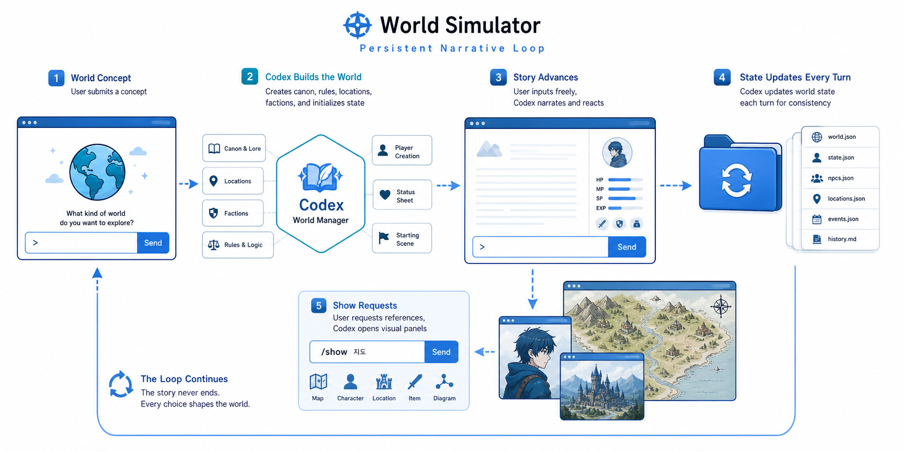

# codex-skills

[](#skills) [](#quick-install) [](docs/assets) [](README.ko.md)

A small, installable catalog of Codex skills for image generation, EPUB translation, animation assets, UI blueprints, subagent creation, podcast scripts, world simulation, Gomoku, and Minecraft stewardship.

Each skill is self-contained with a `SKILL.md` trigger contract plus any local scripts, references, assets, and agent metadata it needs.

Languages: English | [한국어](README.ko.md)


## Why Use This

- Self-contained skills that can be copied into a Codex skills directory.
- Copy-paste install prompts for each skill.
- Practical workflows, not demos.
- Small enough to audit before installing.

## Skills

| Skill | Best for | Output | Install |
| --- | --- | --- | --- |
| [`image-creator`](#image-creator) | Generating, editing, or removing backgrounds from project-local raster images | Saved raster file or true-alpha PNG plus the exact final prompt | [Prompt](#image-creator) |
| [`epub-translator`](#epub-translator) | Naturally translating EPUB books with text-slot extraction and text-bearing images | New translated `.epub`, run folder, chunk translations, image job ledger, and validation summary | [Prompt](#epub-translator) |
| [`animation-creator`](#animation-creator) | Creating project-local character animation assets | Run folder with prompts, layout guides, frames, validation, contact sheets, and previews | [Prompt](#animation-creator) |
| [`ui-blueprint`](#ui-blueprint) | Building or substantially redesigning frontend UI | Generated UI mockup, visual notes, and implemented UI | [Prompt](#ui-blueprint) |
| [`subagent-creator`](#subagent-creator) | Creating or updating custom Codex subagents | One or more TOML agent definitions with the achieved validation level reported | [Prompt](#subagent-creator) |
| [`podcast-writer`](#podcast-writer) | Turning sources into one-person podcast scripts | Plain `.txt` script plus strict content-quality evaluation | [Prompt](#podcast-writer) |
| [`world-simulator`](#world-simulator) | Running a persistent Codex-managed world simulation | Minimal Python GUI plus durable world, player, story, GM, and turn files | [Prompt](#world-simulator) |
| [`gomoku`](#gomoku) | Playing Gomoku against Codex in a local GUI | Python board plus JSON state bridge for Codex moves | [Prompt](#gomoku) |
| [`minecraft-steward`](#minecraft-steward) | Actively stewarding a Paper Minecraft community as Moru | Local chat bridge, configurable steward client, and MSMP administration | [Prompt](#minecraft-steward) |

## Quick Install

Use the preinstalled `$skill-installer` system skill, then restart Codex so the installed skill is picked up.

```text
Use $skill-installer to install skills/<skill-name> from https://github.com/smturtle2/codex-skills.
```

## Catalog

### `image-creator`

Generate or edit raster images, optionally produce a true-alpha transparent PNG, and save the result into the current project.


| Field | Details |
| --- | --- |
| Folder | `skills/image-creator` |
| Use when | You need a generated or edited raster image, a local image reference, or explicit transparent-background output saved into the current project. |
| Produces | A saved raster file or rembg-processed true-alpha PNG, the exact final prompt, bound local input paths, and save metadata. |
| Avoids | Unbound image inputs, rollout or state-database payload lookup, silent opaque transparency fallbacks, and code-native SVG/HTML/CSS artwork. |

Install:

```text
Use $skill-installer to install skills/image-creator from https://github.com/smturtle2/codex-skills.
```

### `epub-translator`

Translate EPUB books into natural target-language prose with text-slot replacement, structure preservation, and image job tracking.


| Field | Details |
| --- | --- |
| Folder | `skills/epub-translator` |
| Use when | You need to translate an EPUB into a natural new target-language EPUB, preserve XHTML/EPUB structure, and handle editable embedded images that contain text. |
| Produces | A new translated `.epub`, run folder, text-slot chunk JSON files, image job ledger, packaging step, and validation summary. |
| Avoids | Overwriting the source EPUB, whole-XHTML rewrites, untracked image edits, and using image generation for images with no text to translate. |

Install `$image-creator` as well when image text translation is needed:

```text
Use $skill-installer to install skills/image-creator and skills/epub-translator from https://github.com/smturtle2/codex-skills.
```

### `animation-creator`

Create character animation assets from a source character image or a generated base character.


| Field | Details |
| --- | --- |
| Folder | `skills/animation-creator` |
| Use when | You need project-local sprite strips, frame sequences, GIF/WebP/MP4 previews, or additional actions that preserve one character identity. |
| Produces | A run folder with canonical base references, action prompts, layout guides, extracted frames, contact sheets, validation JSON, and previews. |
| Avoids | Global packaging, local code-generated character art, and accepting clipped or slot-crossing animation frames. |

Install:

```text
Use $skill-installer to install skills/animation-creator from https://github.com/smturtle2/codex-skills.
```

### `ui-blueprint`

Create a generated UI mockup first, then implement frontend work against that visual blueprint.


| Field | Details |
| --- | --- |
| Folder | `skills/ui-blueprint` |
| Use when | You are building new UI, doing a substantial redesign, or working on a visually led screen. |
| Produces | A generated mockup, extracted layout and visual decisions, and implementation guidance for the existing frontend stack. |
| Avoids | Skipping the blueprint for visually important UI work, and applying the workflow to narrow bug fixes or small maintenance edits. |

Install:

```text
Use $skill-installer to install skills/ui-blueprint from https://github.com/smturtle2/codex-skills.
```

### `subagent-creator`

Create or update one or more Codex custom subagents from natural-language role briefs, matching the number the user explicitly requests.


| Field | Details |
| --- | --- |
| Folder | `skills/subagent-creator` |
| Use when | You need to create or update one or more Codex custom subagents from natural-language briefs. |
| Produces | The explicitly requested number of TOML agent definitions, each with a clear role, tool policy, constraints, and the achieved validation level reported. |
| Default location | `$CODEX_HOME/agents`; falls back to `~/.codex/agents` when `CODEX_HOME` is unset. |
| Outside scope | `[agents]` runtime settings and spawning or executing subagents. |
| Avoids | Inventing MCP URLs or credentials and snapping to canned role examples unless required. |

Install:

```text
Use $skill-installer to install skills/subagent-creator from https://github.com/smturtle2/codex-skills.
```

Docs:

- https://developers.openai.com/codex/subagents
- https://developers.openai.com/codex/concepts/subagents

### `podcast-writer`

Turn PDFs, text files, websites, and YouTube transcripts into a one-person podcast script saved as plain text.


| Field | Details |
| --- | --- |
| Folder | `skills/podcast-writer` |
| Use when | You need Codex to collect source material, use YouTube captions or GPU-only Whisper transcription when needed, write a one-person podcast monologue, and keep revising until strict content-quality evaluation passes. |
| Produces | A saved `.txt` script, source handling notes, and a strict subagent evaluation with all rubric items passing. |
| Avoids | Speaker labels, interview/dialogue format, source-free claims, final-script metadata, and using the evaluator for TTS or formatting checks. |

Install:

```text
Use $skill-installer to install skills/podcast-writer from https://github.com/smturtle2/codex-skills.
```

### `world-simulator`

Run a persistent free-form world simulation through a minimal Python GUI while Codex manages world state, hidden GM notes, and turn progression.



| Field | Details |
| --- | --- |
| Folder | `skills/world-simulator` |
| Use when | You want a GUI-mediated narrative sandbox where Codex creates the world, manages the player character, and advances the story from free-form user input. |
| Produces | A local GUI, durable session folders, visible story state, hidden GM state, and append-only turn records. |
| Avoids | Story input through chat, fixed RPG stat schemas, story choice buttons, and Python-generated narrative decisions. |

Install:

```text
Use $skill-installer to install skills/world-simulator from https://github.com/smturtle2/codex-skills.
```

### `gomoku`

Play Gomoku with a local Python GUI while Codex waits, reads Codex view JSON, and applies its own moves.


| Field | Details |
| --- | --- |
| Folder | `skills/gomoku` |
| Use when | You want to play Gomoku with a local Python GUI while Codex chooses and applies its own moves. |
| Produces | A Pygame board, internally managed state, move validation, win detection, optional Renju restrictions, and Codex wait/apply commands. |
| Avoids | A fixed AI engine and OpenAI API calls from the GUI. |

Install:

```text
Use $skill-installer to install skills/gomoku from https://github.com/smturtle2/codex-skills.
```

### `minecraft-steward`

Run Moru, a Codex-led Minecraft community steward that observes player chat, welcomes first-time players, answers verified server questions, and executes administrator-selected console commands.

| Field | Details |
| --- | --- |
| Folder | `skills/minecraft-steward` |
| Use when | You need Codex to actively steward a configured Paper server, respond naturally to useful player conversations, or perform explicit server administration. |
| Produces | A local-only MoruBridge Paper plugin, token-free client profile, bounded live event queue, safe server snapshot, console command client, and MSMP client commands. |
| Decision authority | Codex decides whether and how to reply or administer; it can execute server console commands. The bridge only observes, transports, and executes Codex's explicit actions. |
| Player messages | Codex writes every player-facing message as `Moru: <message>`; the bridge preserves that exact text without adding a label. |
| Avoids | Canned auto-responses, public management ports, persistent raw-chat logs, and player-authorized administrator actions. |

Install:

```text
Use $skill-installer to install skills/minecraft-steward from https://github.com/smturtle2/codex-skills.
```

## Repository Layout

- `skills/`: skill folders ready to copy into a Codex skills directory.
- `skills/*/SKILL.md`: the instruction body Codex reads when a skill is triggered.
- `skills/*/scripts/`: helper scripts bundled with a skill.
- `skills/*/references/`: optional supporting references used by a skill.
- `skills/*/assets/`: skill icon assets and reusable bundled files.
- `skills/*/agents/`: optional agent/provider metadata for a skill.
- `docs/assets/`: README images and repository-level documentation assets.

## Contributing

New skills should include a `SKILL.md`, a clear trigger description, and any required scripts or references inside the skill folder.

Quality bar:

- Clear trigger rules.
- Minimal bundled context.
- No hidden credentials.
- Local, auditable scripts.
- Skill icon assets and agent metadata references when a skill is listed in the catalog.
- README entry and install prompt.

## Notes

- Root docs describe the catalog.
- Skill behavior lives in each skill's `SKILL.md`.
- Restart Codex after installing or updating a skill.
